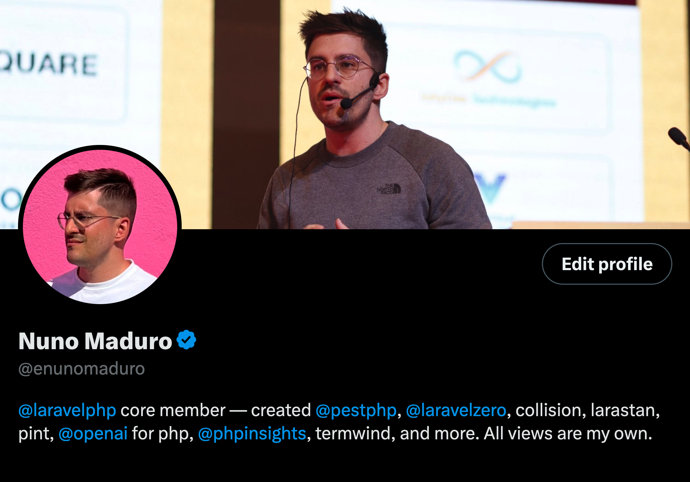
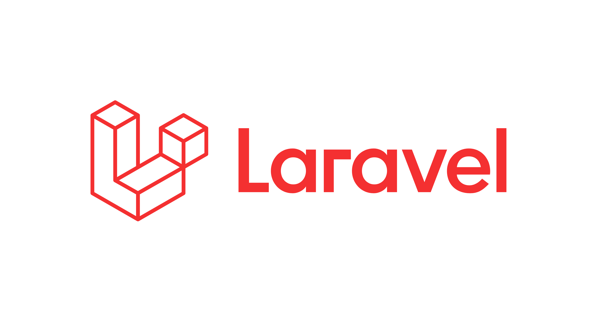
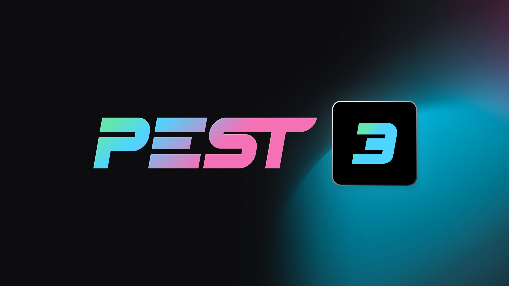

- Wi-fi off and notifications off...
- TODO: reset git of talk + opening the project on phpstorm
- PHPStorm on window fullscreen (with terminal down + decide the fist file open)
- Deckset on window fullscreen

---

[.background-color: #000000]

---

[.background-color: #FFFFFF]

---

[.background-color: #000000]
---

# Modern
## _PHP Tooling_

---

- Linting, Fixing Typos, Type Checking
- Modern Syntax, Parallel Testing, Type Coverage
- Code Coverage, Arch Testing, Scripts

---

# Pint / _Linting_
### Keep Things Clean

^ Demo: dummy changes on app service provider, after:
^ 1: strict types, final classes,
^ 2: method ordering, == | ===
^ Joke: "Not the pint that most of you drink"
^ 4 minutes

---

# Peck
## _Fixing Typos_
### No More Embarrassing Typos

^ Demo two typos on ValueObjects/Person.php
^ 2 minutes (6min total)

---

# PhpStan
## _Type Checking_
### Push to prod with your eyes closed

^ Most of probably already know, if you don't know, what are you doing with your life?
^ It's the equivalent of TypeScript for PHP
^ To the point, you can even push to prod with your eyes closed...
^ 3 minutes (9min total) (generic examples?)

---

# Rector
## _Code Modernization_
### Be ready for PHP 9 in seconds!

^ We can not talk about phpstan without talking about rector
^ PHPStan warns you about the issues, Rector fixes them
^ You can be ready for newer PHP versions in seconds
^ Let show you some examples!
^ 2:30s minutes (11:30min total)

---

# Pest
## _Parallel Testing_
### Less Waiting, More Coding

---

# Pest
## _Type Coverage_
### Sleep like a baby

---

# Pest
## _Code Coverage_
### No blind spots

---

# Pest
## _Arch Testing_
### Keep your codebase modular

---

# Composer Scripts
## _Run them all!_

---

### **youtube.com/nunomaduro**
