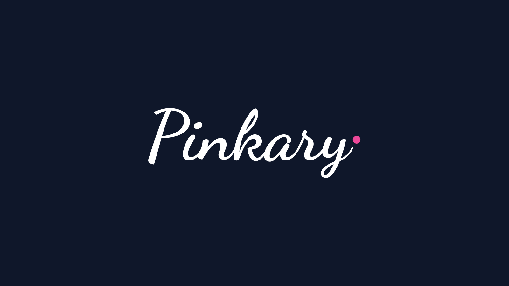

- t && git add . && git reset --hard && export XDEBUG_MODE=coverage && subl .
- Wifi off and notifications Off
- Deckset on window fullscreen
- Open firefox
- Sublime & Terminal side-by-side, open 1/PostsTests, run pest on terminal 1

---

[.background-color: #000000]
---

[.background-color: #000000]

---

[.background-color: #FFFFFF]
---

[.background-color: #000000]
---

---

## PEST v1.0
### _Spring 2021_

---

[.background-color: #000000]

---

## PEST v2.0
### _Spring 2023_

---

**--profile** analysis ∙ **--coverage** reports ∙ **--parallel** support ∙ **Arch testing** ∙ **--watch** mode ∙ **datasets** ∙ **--drift** from PHPUnit ∙ **--type-coverage** ∙ Mocking  ∙ **Snapshot** Testing ∙ **--todos** ∙ **--retry** ∙ **stress testing**

---

## 18 million
### _Total Downloads_

---

[.background-color: #FFFFFF]

---

# PEST v3.0
## _Test. Like never before._

---
---

---

---

### **TASK MANAGEMENT**
### issue, tickets, notes. Literally.

---
---

---

---

### **ARCH PRESETS**
### php, laravel, security, and more...

---
---

---

# MUTATION TESTING

---

---

[.background-color: #000000]

---

[.background-color: #000000]

---

# Pest 3
### _Release_ **Next Week!**

---
---

## just a "_composer update_" away from you.

---

One more thing...

---
---

---

---

---

## Pinkary
#### _Open Source_ **Today!**

# Pest 3
### _Release_ **Next Week!**
